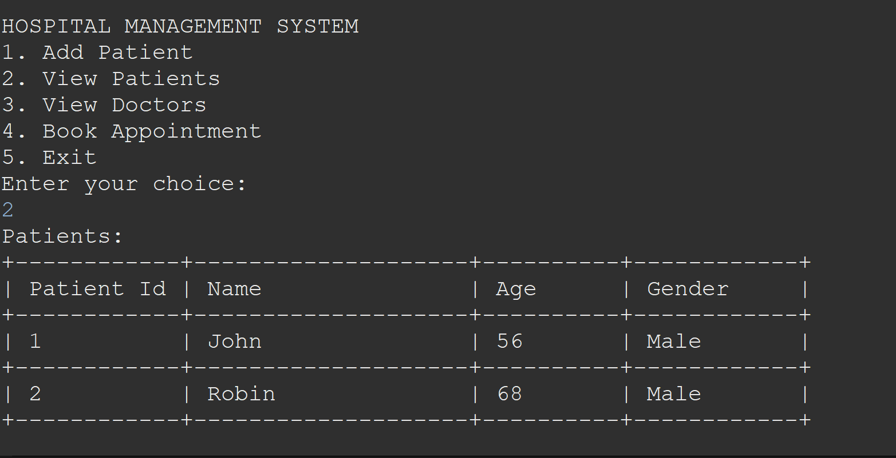
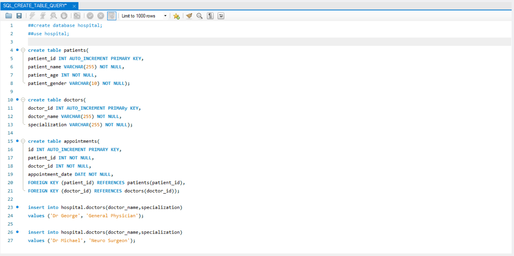

# Hospital Management Application Documentation





## Overview

Welcome to the Hospital Management Application, a Java-based solution for managing patient details, viewing doctors, and booking appointments. This application utilizes JDBC with MySQL as the backend database, offering seamless connectivity and efficient data management.

## Features

### 1. Adding Patient Details

Users can add patient details to the database by providing essential information such as name, age, gender. The application ensures accurate and secure storage of patient records.

### 2. Viewing Doctors

The "View Doctors" feature allows users to access a list of doctors available in the hospital. Information such as the doctor's name, specialization is displayed to assist patients in making informed choices.

### 3. Booking an Appointment

Patients can book appointments based on the availability of doctors. The application checks the doctor's schedule, ensuring that appointments are booked only during their free slots. The booking process includes selecting a preferred doctor and specifying the desired appointment time.

## How to Use

1. **Installation**: Before using the application, make sure to install the MySQL Connector for Java and add it to the classpath.
https://dev.mysql.com/downloads/connector/j/

2. **MySQL Database**: Also note that you have MYSQL database installed and running in the background.

3. **SQL Query**: Run the SQL query provided alongside in the repository in MySQL WorkBench or MySQL Shell to create schemas for patients and doctors.

4. **JDBC Driver**: We'll be using JDBC driver downloaded and added to our classpath (step 1) to connect to our database and do CRUD operations accordingly.

```Java
// Sample code snippet for connecting to MySQL database using JDBC and mysql connector.
public static Connection createDBconnection() {
		
		try {
			
			Class.forName("com.mysql.cj.jdbc.Driver");
			
			final String url = "jdbc:mysql://localhost:3306/hospital?useSSL=false";
			final String username = "root";
			final String password = "password";
			
			con = DriverManager.getConnection(url,username,password);
			
		}catch(Exception ex) {
			ex.printStackTrace();
		}
		return con;
	}

// Sample code snippet from the code
while(true){
            System.out.println("HOSPITAL MANAGEMENT SYSTEM ");
            System.out.println("1. Add Patient");
            System.out.println("2. View Patients");
            System.out.println("3. View Doctors");
            System.out.println("4. Book Appointment");
            System.out.println("5. Exit");
            System.out.println("Enter your choice: ");
            int choice = sc.nextInt();

            switch(choice){
                case 1:
                    // Add Patient
                    patient.addPatient();
                    System.out.println();
                    break;
                case 2:
                    // View Patient
                    patient.viewPatients();
                    System.out.println();
                    break;
                case 3:
                    // View Doctors
                    doctor.viewDoctors();
                    System.out.println();
                    break;
                case 4:
                    // Book Appointment
                    bookAppointment(patient, doctor, con, sc);
                    System.out.println();
                    break;
                case 5:
                    System.out.println("THANK YOU!!! FOR USING HOSPITAL MANAGEMENT SYSTEM!!");
                    return;
                default:
                    System.out.println("Enter valid choice!!!");
                    break;
            }
}
